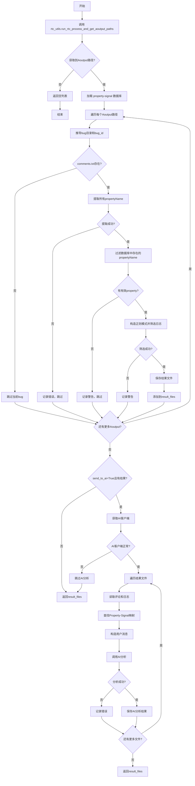

# pull_logs_filter_by_property 函数流程图

## 流程图 (Mermaid)

## 主要处理步骤

1. **初始化**: 获取Aoutput路径并加载Property-Signal数据库
2. **循环处理**: 对每个Aoutput路径进行以下操作
   - 提取并验证Property名称
   - 筛选相关日志
   - 保存结果
3. **AI分析** (可选): 对筛选结果进行智能分析
4. **返回结果**: 返回处理结果文件路径列表

## 关键特性

- 处理多级异常情况
- 支持AI智能分析
- 结果可追溯